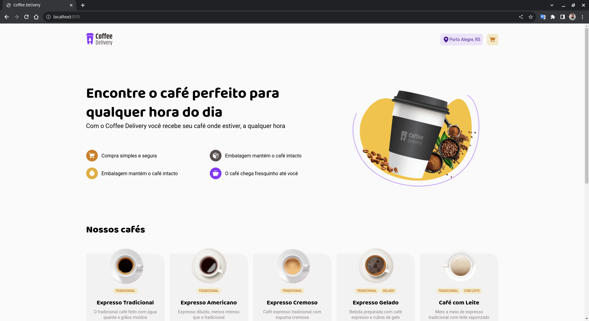
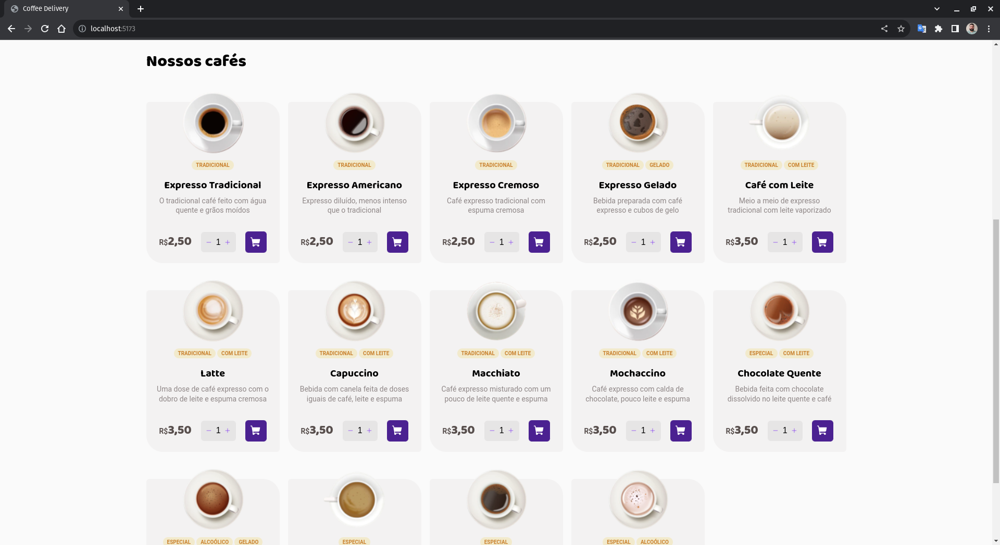
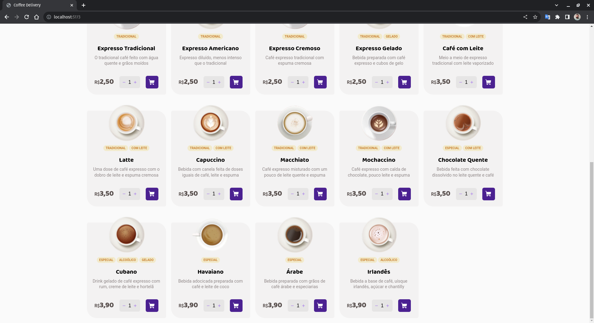
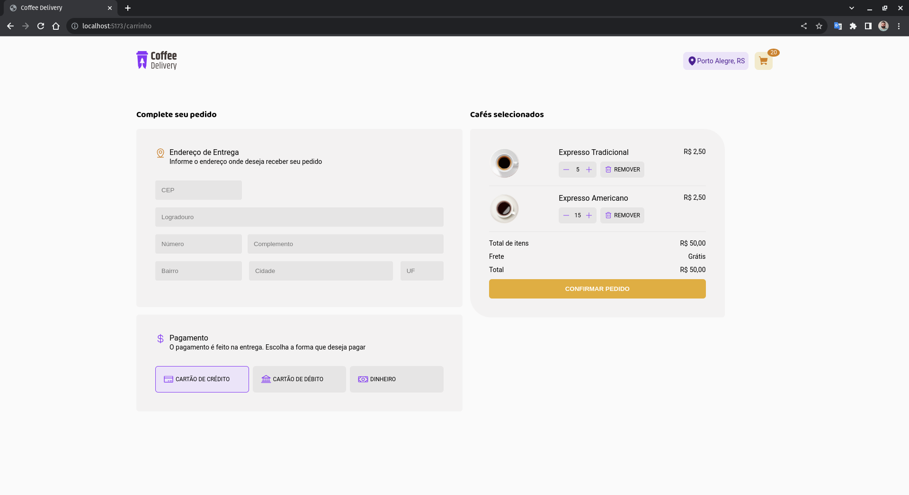
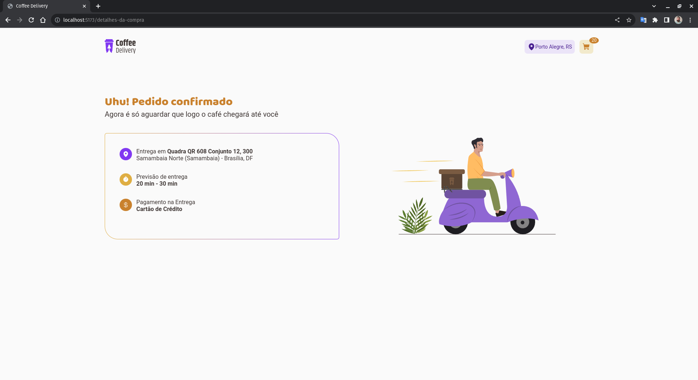

# Coffee Delivery

Desafio do segundo módulo do curso de ReactJS da Rocketseat.  
A proposta era a criação do front-end do e-commerce de uma cafeteria, seguindo à risca o layout apresentado pela equipe de design.

  

## Solução  

### Como Rodar a Aplicação:  
- Possuir o NodeJS instalado
- Instalar as dependências utilizando `npm install`
- Executar a aplicação através do comento `npm run dev`  

### Especificações Técnicas:
- Tecnologias Utilizadas:
  - [ReactJS](https://react.dev/)
  - [Vite](https://vitejs.dev/)
  - [TypeScript](https://www.typescriptlang.org/)
  - [Styled-Components](https://styled-components.com/)
  - [React Hook Form](https://www.react-hook-form.com/)
  - [Phosphoricons](https://phosphoricons.com/)
  - [React IMask](https://github.com/uNmAnNeR/imaskjs/tree/master)

### Progresso:

Componentes:

- [x] Titulo e Subtitulo
- [x] Navbar
- [x] Vertical Card
- [x] Horizontal Card

Páginas:

- [x] Home
- [x] Carrinho
- [x] Detalhes da Compra

Features/Características:

- [x] Apresenta uma lista de cafés, com seus respectivos valores.
- [x] Usuário poderá escolher um tipo de café por vez e adicionar de 1 a 20 unidades ao carrinho.
- [x] No carrinho, o usuário pode alterar a quantidade de cafés (respeitando o mínimo de 1 e o máximo de 20 unidades).
- [x] No carrinho, o usuário pode remover os cafés.
- [x] O frete é calculado de acordo com a quantidade de itens e para compras acima de R$ 50,00 o frete é grátis.
- [x] Caso o usuário já tenha add um tipo de café, ele só poderá alterar a quantidade ou remover o item ná pagina '/carrinho'
- [x] No menu de navegação da página, no ícone do carrinho, deve aparecer a quantidade de itens do pedido.  

### Evidências:  

